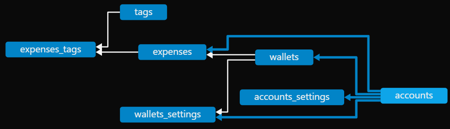

# Database Structure 0.0.1_b
This file is a new version of the 0.0.1 file.
It has been written before implementation of the older version thus it requires no conversion function. 

# General info about these files
This file describes the data structure of the Database.
If the database structure is changed a new file is needed.
A conversion function must be made to convert from the old data structure to the new one.
The file should be modified only for typos or unclear wording.  
The name of the file is the first version of introduction.
[Table generator](https://www.tablesgenerator.com/markdown_tables#)

# Naming conventions
All names should follow [snake_case](https://en.wikipedia.org/wiki/Snake_case) naming convention
The table for each object is named as such "name_object"+"s"
The id of each object is named as such "name_object"+"_id"
All object with an id must have a name, names don't need to be unique
Currently implemented objects : ["account", "wallet", "date", "expense", "tag"]

| object name | table    | id         | other variables    |
|-------------|----------|------------|--------------------|
| account     | accounts | account_id | account_id_counter |
| tag         | tags     | tag_id     | tag_id_counter     |
| setting     | settings | setting_id | setting_id_counter |
| fish        | fishs    | fish_id    | fish_id_counter    |

# Databases
## Config.db
Always located at `CommandCoin$\data\Config.db`.
Contains data needed for the program to run like important data or references and api keys.

### Tables
List of tables of the database.

#### settings 
Contains user-configurable options that modify program behavior.
These represent adjustable choices (currency, theme, rules).
| Column  | Type | Description    | Example                |
|---------|------|----------------|------------------------|
| setting | TEXT | primary key    | auto_update, use rule1 |
| value   | TEXT | setting value  | true, 1                |

#### data
Contains essential data required by the program.
Unlike settings, these values aren't meant for user configuration.
| Column  | Type | Description    | Example                  |
|---------|------|----------------|--------------------------|
| name    | TEXT | primary key    | BBVA_api_key, start_date |
| value   | TEXT | setting value  | 0absd0123, 12/03/2022    |

## CommandCoin$.db
Default path is `CommandCoin$\data\CommandCoin$.db`.
The path can be changed to any preferred path.
The path is saved in the data table in the Config database. 
Contains all the user data.
Non global settings are stored here (Accounts and Wallets settings). 

### Data structure


Accounts represent each bank account.
Wallets divide your bank account into funds for different purposes.
For example you might want to divide your money into needs and wants etc. 
Each wallet contains a list of dates, each time you add a purchase or a transaction it will be stored in the corresponding date.
Each transaction contains a list of tags that identify better the transaction. 

#### ID
Ids are incremental and immutable.
Ids all start from 0.
Ids are auto incremented. 
Id structure : [x.y.z.w]
- x : Account Id.
Incremented by 1 each time one is created.
- y : Wallet Id.
Incremented by 1 each time one is created.
- z : Date Id.
The starting date is saved in Config\data as date 0.
The id of the date is incremented each day by 1. 
Negative dates are possible.
- w : Expense Id.
Incremented by 1 each time one is created.

### Tables
List of tables of the database.

#### accounts
Contains the list of all accounts.
| Column     | Type    | Description           | Example                 |
|------------|---------|-----------------------|-------------------------|
| account_id | INTEGER | primary key, positive | 2, 3, 5, 6              |
| name       | TEXT    | name of the account   | BBVA, American Express  |

The column name is UNIQUE to ensure unique naming

#### wallets
Contains the list of all wallets.
| Column     | Type    | Description                     | Example                 |
|------------|---------|---------------------------------|-------------------------|
| account_id | INTEGER | composite primary key, positive | 2, 3, 5, 6              |
| wallet_id  | INTEGER | composite primary key, positive | 2, 3, 5, 6              |
| name       | TEXT    | name of the wallet              | investment, savings     |

The columns account_id and name are UNIQUE to ensure unique naming for each account

The table references the Account table.
To ensure data integrity the following code is needed:
``` sql
FOREIGN KEY (account_id) REFERENCES accounts(account_id) ON DELETE CASCADE
```

#### tags
Contains the list of all tags.
| Column      | Type    | Description                        | Example                                |
|-------------|---------|------------------------------------|----------------------------------------|
| Tag_Id      | INTEGER | composite primary key, positive    | 2, 3, 5, 6                             |
| Name        | TEXT    | name of the tag                    | House, Light, Gas                      |
| Description | TEXT    | short description of the tag       | Gas bill from Enel, Cleaning and soaps |

The column name is UNIQUE to ensure unique naming

#### expenses
List of all expenses.
| Column      | Type    | Description                      | Example                     |
|-------------|---------|----------------------------------|-----------------------------|
| account_id  | INTEGER | composite primary key, positive  | 1, 2, 123, 1                |
| wallet_id   | INTEGER | composite primary key, positive  | 1, 2, 123, 1                |
| date_id     | INTEGER | composite primary key            | 1, -2, 123, -20             |
| expense_id  | INTEGER | composite primary key, positive  | 1, 2, 123, 1                |
| name        | TEXT    | short description of the expense | "groceries", "bike", "gift" |
| description | TEXT    | long description of the expense  | "22 cans of soup for today" |
| value       | INTEGER | price stored as cents            | -120 = -1.2€, 12300 = 123€  |

The table references the Account and Wallet tables.
To ensure data integrity the following code is needed:
``` sql
FOREIGN KEY (account_id) REFERENCES accounts(account_id) ON DELETE CASCADE
FOREIGN KEY (wallet_id) REFERENCES wallets(wallet_id) ON DELETE CASCADE
```

#### expenses_tags
Mapping between expenses and tags.
| Column      | Type    | Description                     | Example         |
|-------------|---------|---------------------------------|-----------------|
| account_id  | INTEGER | composite primary key, positive | 1, 2, 123, 1    |
| wallet_id   | INTEGER | composite primary key, positive | 1, 2, 123, 1    |
| date_id     | INTEGER | composite primary key           | 1, -2, 123, -20 |
| expense_id  | INTEGER | composite primary key, positive | 1, 2, 123, 1    |
| tag_id      | INTEGER | composite primary key, positive | 1, 2, 123, 1    |

The table references the Expenses and Tags table.
To ensure data integrity the following code is needed:
``` sql
FOREIGN KEY (account_id, wallet_id, date_id, expense_id) 
REFERENCES expenses(account_id, wallet_id, date_id, expense_id) ON DELETE CASCADE
FOREIGN KEY (tag_id) REFERENCES tags(tag_id) ON DELETE CASCADE
``` 

#### accounts_settings
List of settings for each account.
| Column     | Type    | Description                     | Example                 |
|------------|---------|---------------------------------|-------------------------|
| account_id | INTEGER | composite primary key, positive | 2, 3, 5, 6              |
| setting    | TEXT    | composite primary key           | auto_update, use_rule_1 |
| type       | TEXT    | variable type                   | bool, integer, float    |
| value      | TEXT    | setting value                   | true, 1                 |

The table references the Account table.
To ensure data integrity the following code is needed:
``` sql
FOREIGN KEY (account_id) REFERENCES accounts(account_id) ON DELETE CASCADE
```

#### wallets_settings
List of settings for each wallet.
| Column     | Type    | Description                     | Example                 |
|------------|---------|---------------------------------|-------------------------|
| account_id | INTEGER | composite primary key, positive | 2, 3, 5, 6              |
| wallet_id  | INTEGER | composite primary key, positive | 2, 3, 5, 6              |
| setting    | TEXT    | composite primary key           | auto_update, use_rule_1 |
| type       | TEXT    | variable type                   | bool, integer, float    |
| value      | TEXT    | setting value                   | true, 1                 |

The table references the Account and Wallet tables.
To ensure data integrity the following code is needed:
``` sql
FOREIGN KEY (account_id) REFERENCES accounts(account_id) ON DELETE CASCADE
FOREIGN KEY (wallet_id) REFERENCES wallets(wallet_id) ON DELETE CASCADE
```
